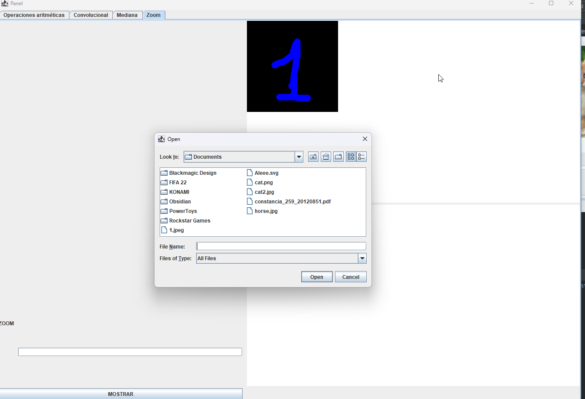

## Compilar y ejecutar
Ingresar en la carpeta y ejecutar "maven install".
Luego ejecutar el jar generado: "target/Practice1-1.0-SNAPSHOT-jar-with-dependencies.jar"

## Operaciones aritméticas

Primero hacer click en el recuadro superior izquierdo y elegir una imagen.

Efectuar la misma operación para el recuadro superior derecho.

Seleccionar la operación que se quiere efectuar e ingresar un valor de ser necesario.

Hacer click en el recuadro inferior derecho para obtener el resultado.

## Filtro convolucional

Primero hacer click en el recuadro superior izquierdo y elegir una imagen.

Ingreasar el kernel en el recuadro inferior derecho, filas separadas por saltos de línea y columnas separadas por ";"

Hacer click en el recuadro superior derecho para obtener el resultado.

## Mediana
Primero hacer click en el recuadro superior izquierdo y elegir una imagen.

Ingresar el valor del filtro y presionar el botón "Ejecutar" para visualizar el resultado.

## Zoom
Primero hacer click en el recuadro superior derecho y elegir una imagen.

Luego ingresar el valor factor de zoom y presionar el botón "MOSTRAR".
